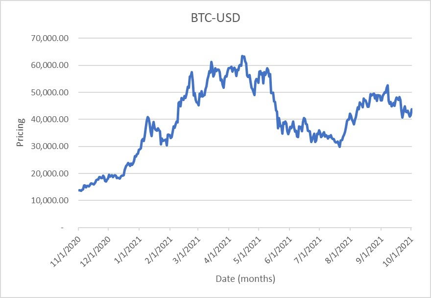
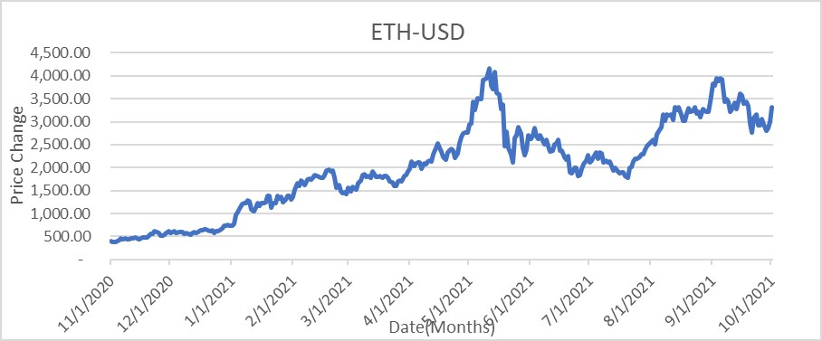
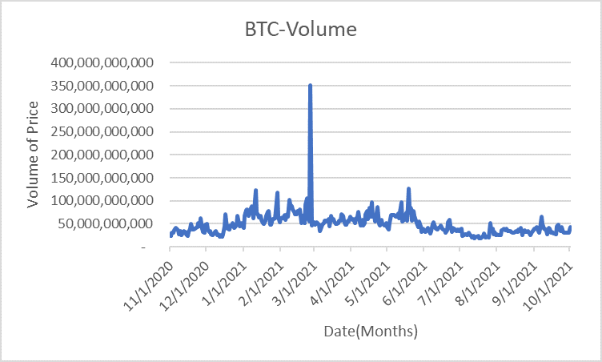
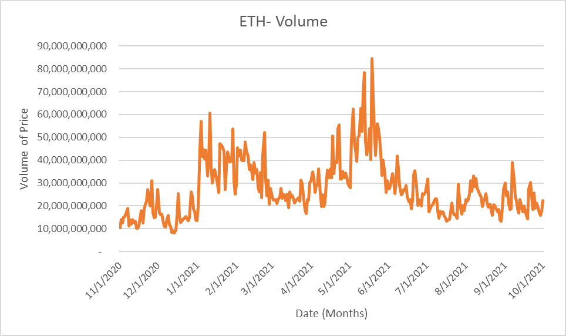

# Research Paper_David_B
 **Research paper on data analysis of Cryptocurrencies**

*This paper will dive into the research of Cryptocurrencies such as Bitcoin and Etherium, compairing the 
two over the course of a year period for growth, change and overall effects of the market.*

## **Data Analysis of Cryptocurrencies in Today's Market**

### *David Allen Bekele, Dr.Garrett Dancik*

## **Abstract** 
This study we compare the Cryptocurrencies of Ethereum and Bitcoin over a Twelve-month period. The data analysis compared both digital currency’s using comparisons in volume of change, price fluctuations, and weekday to weekend pricing. 
Additionally, the use of major world events was also viewed to see cause-effect relation to crypto pricing. In this study, correlation was found with pricing and in volume, with pricing having a correlation result of 0.6701 and volume being 0.6234 
showing both crypto currencies had a significant correlation with each other. Weekday and weekend were shown to have a drop in price during weekends and an increase in price during weekdays. While major world events were only shown to have a slight
effect on pricing changes.

## **Introduction**
The use of cryptocurrency is prevalent in today’s society. More now than ever the use of trading of digital currency is constantly used and continues to grow, and for that reason understanding the market trends and effects becomes important [1]. 
With learning about the data analysis of cryptocurrencies, information can be taken about how price trends are affected, giving a better view on investment options in the finical sense. Things like when to invest, what may be best to invest and future options will be explored in this paper. 
Having a better grasp of this information can lead to better financial decisions and creating better informed decisions when investing in digital currencies and, hopefully, give the reader the best chance at creating financial success.  To dive into this topic, an understanding of both Cryptocurrency and the technology behind it, Blockchain, is needed for better perception of this research. 
To begin, Blockchain itself is the use of decentralized database shared among networks that store information digitally. Blockchain has a high privacy usage and encryption technology [2] 
which has been used in the new creation of cryptocurrencies in today’s digital markets. Cryptocurrencies themselves are derivative of the blockchain technology, using what blockchain used to create its privacy in the form of "hashes". These hashes are special as they cannot be copied, removed, or altered in any way. Because of this, they become the perfect 
tool for trade as it covers the security risk other forms of technology may have. Cryptocurrency, while not only being secure and private, is also not backed by any government, and is instead backed independently by the users who trade it, this creates a freer market where the currency is safer from hyperinflation. This data analysis will cover two of the most traded Cryptocurrency’s today, that being Bitcoin (BTC) and Ethereum (ETH) [3]. 
The analysis was conducted by answering several questions on the bases of taking the pricing and volume of each of these cryptocurrencies over a year period then collecting/analyzing this data on excel graphs and sheets. These graphs helped us answer several questions, that being our price and volume fluctuating at the same pattern, what are the pricings for weekdays and weekends, and do major world events effect trading?
This paper will answer these questions revealing market trends within cryptocurrency today.

## **Methods & Materials**
Data was collected online using a public commercial domain website of "Yahoo Finance" where information over a Twelve-month period starting with November 1st ending with October 1st was downloaded for the two independent variables used.
Ethereum and Bitcoin as the main Cryptocurrency, in order to test the effect of these two variables a full factorial experiment was designed for the variables.
Two factors were identified for the use of this experiment, namely Pricing change of currency and the volume fluctuation over time.
Data of these factors were collected as shown in [figure 1]() 
in excel spreadsheet when downloaded.
For each date during the twelve-month period each price and volume was listed individually. 
Three sets of graphs were created from this data using excel software for data organization and graph making for both Ethereum (ETH) and Bitcoin (BTC); pricing as a dependent variable (in USD) and date in months for the dependent variable. A line graph was made and can be seen in figure 2 in results. For Volume, the exact method is used like in pricing, with volume replacing the independent variable of pricing instead. A line graph was then created distributing the data over the twelve-month period. Lastly, A bar graph is used to compare the data of weekends vs weekday pricing of both cryptocurrencies separately. 
The equation for average was used by combining all days of weekdays and all days of weekends together and dividing by the total. This bar graph is the same for both Ethereum and Bitcoin with pricing being independent and week faction being dependent for the variable.
The data collected for this study is available at the following link https://github.com/MR-DAV-GONE/Research-Paper_David_B.

## **Results** 
The analysis of both Ethereum and Bitcoin cryptocurrencies states that both were graphed it was found that both fluctuate at a similar pattern during the twelve-month period by having a gradual increase in the last months of the 2020s then having both of their peaks in price arriving during the April to May period.
Data of this variety was compared using the pricing line graph shown in [figure 2A]() & [figure 2B]() showing for both pricing of Ethereum and graph for Bitcoin. 
Data has shown that Bitcoin trading is at a significantly higher price than that of Ethereum currency, with Bitcoin having an average trading between $10,000-$70,000 while Ethereum being in the $500-$5,000 range. 
This correlation extends to the months of April to May 2021 where both Cryptocurrency’s had the highest increase in their respective prices then began a steady decrease after in price.
Using an Excel correlation calculation, the volume of both Ethereum and Bitcoin was compared, with a number being between 1 to (-1) showing a strong correlation with the data.
Data analysis of Volume reveled similar trends within the data [Figure 3A]() & [Figure 3B]() comparing both Ethereum and Bitcoin Cryptocurrency’s.   
Both follow trends within their data reflecting the pricing counterpart of their cryptocurrency although some differences between them are seen. 
The volume of bitcoin contains a great spike in volume within the March 2021 period before returning back to a more stable pattern, while Ethereum has more stable fluctuations then its Bitcoin counterpart over the year period.
The Correlation was repeated for Volume, giving a correlation calculation of 0.623 showing that both volumes of cryptocurrencies have a strong relation to each other.
Lastly, data analysis of weekdays vs weekends Figure 4A & 4B shows that there is a
significant difference in the average price of cryptocurrency. 
Both Ethereum and Bitcoin have observed to have higher average prices during the weekdays while the price lowers during the weekends. For Ethereum there is a $14 difference and for Bitcoin there was only a $1.76
difference revealing there is a greater difference in price for Ethereum than bitcoin.

## **Discussion**

What was found was that for pricing in Cryptocurrency’s our original idea that if volume in one cryptocurrency increases it would increase in another was proven correct. This correlates to the idea that all cryptocurrencies fluctuate at a similar pattern, or that if one crypto significantly changes then most likely others will as well, although there are some discrepancies on how large this change is, as Bitcoin had a more extreme change in volume and price than did Ethereum [4].
What this can tell is that better financial choices can be made by looking at a change in price, for instance, if there is a significant drop in price, that may be evidence of "buy the dip" before there is an increase in price raising the value of one’s currency. 
If there is shown to be a high increase in a price, this might show that it might not be the best time to buy.   
Moreover, differences between the average of weekday pricing and weekend pricing reveals that there is a slight drop in price during the weekend and an increase in price during the weekday. A theory for this is that since Crypto is traded 24/7, there is more of a chance for price to rise during a five-day period than a two-day period, creating a slight difference in price. It was also found that Ethereum [5] had a greater difference in price than did bitcoin. 
How this information is significant is that the data gives the best time to either buy or sell one’s cryptocurrency.
Discussion of if events effect has been mentioned within the introduction, these three events being Chinas ban on cryptocurrency’s (Sept 24th ), El Salvador legalizing cryptocurrency’s (sept 7th) and the most major event being the GameStop short squeeze event of early 2021. From these three events changes in the pricing of cryptocurrency can be noticed slightly. For instance, during the Chinese government ban on Cryptocurrency there is a slight dip with price within the first few weeks of that month for Ethereum, after which a slight increase begins to take place (although volume had a major increase in BTC and slight increase in ETH).
Moreover, during the GameStop Short squeeze of early January leading to March there was a gradual increase in both the price of Ethereum and in Bitcoin that then both peaked around the April to May period [5]. It could be said that the popularity of the stock increase effected the buy sales of these cryptocurrencies, as it effected another Crypto stock, Dogecoin. Overall, it can be said that world events create slight differences in Crypto prices but do not make major changes. Although, these changes could benefit those who are interested in investment into different crypto stock. 
Having adequate knowledge of world events happening can give such investors an edge in the market on if such dips and increases would actually happen. 
GameStop Short squeeze is evidence of this, as such a drastic increase in price has been greatly successful for short term investments.

## **Conclusion** 

Through this data analysis we find that there is a correlation between the rise and fall of different cryptocurrencies in how they react to both Ethereum and Bitcoin being bought and sold in a twelve-month period. While for volume it is more sporadic but still following a similar trend despite major outliers.
Week and weekend show that there is only a slight difference in pricing between the averages, and with bitcoin being more insignificant difference.
Major world events have also shown to slightly effect the buy and sell events within both cryptocurrencies, with cheaper crypto currency’s (Ethereum) having more extreme changes.
Some things to mention, the accuracy of this data analysis can be improved with the addition of starting the data collection in the beginning when these cryptocurrencies are first created. This is due to the bias made when data collecting, as the twelve-month period only covers during the major events of covid, and does not show such markets before this event. 
In addition, multiple different cryptocurrencies should be covered as well to be more accurate, as covering only two major cryptocurrencies (and only mentioning Dogecoin) can show major bias in the data.

## **References**

###### *[1] Kastensson Fan, Daniel. A Blockchain-Based Solution to High-Volume Web Scraping With Smart Contracts on Ethereum, 2018. http://urn.kb.se/resolve?urn=urn:nbn:se:kth:diva-247890.*
###### *[2] Regueiro, Cristina, Iñaki Seco, Santiago de Diego, Oscar Lage, and Leire Etxebarria. “Privacy-Enhancing Distributed Protocol for Data Aggregation Based on Blockchain and Homomorphic Encryption.” Information Processing & Management 58, no. 6 (November 1, 2021): 102745. https://doi.org/10.1016/j.ipm.2021.102745.*
###### *[3] Routledge, Bryan, and Ariel Zetlin-Jones. “Currency Stability Using Blockchain Technology.” Journal of Economic Dynamics and Control, May 23, 2021, 104155. https://doi.org/10.1016/j.jedc.2021.104155.*
###### *[4] Heijningen, Guus van. “MAKING PREDICTIONS IN HIGHLY VOLATILE CRYPTOCURRENCY MARKETS USING WEB SCRAPING,” n.d., 55.*
###### *[5] Melki, Abir, and Nourhaine Nefzi. “Tracking Safe Haven Properties of Cryptocurrencies during the COVID-19 Pandemic: A Smooth Transition Approach.” Finance Research Letters, June 17, 2021, 102243. https://doi.org/10.1016/j.frl.2021.102243.*
###### *[6] Vasileiou, Evangelos. 2021. "Explaining Stock Markets' Performance During The COVID‐19 Crisis: Could Google Searches Be A Significant Behavioral Indicator?". Intelligent Systems In Accounting, Finance And Management 28 (3): 173-181. doi:10.1002/isaf.1499.*
###### *[7] Kausar, Firdous, Fahad M. Senan, Hafiz M. Asif, and Kaamran Raahemifar. “6G Technology and Taxonomy of Attacks on Blockchain Technology.” Alexandria Engineering Journal, September 29, 2021. https://doi.org/10.1016/j.aej.2021.09.051.*
###### *[8] Stallone, Valerio, Martin Wetzels, and Michael Klaas. “Applications of Blockchain Technology in Marketing Systematic Review of Marketing Technology Companies.” Blockchain: Research and Applications, July 9, 2021, 100023. https://doi.org/10.1016/j.bcra.2021.100023.*
###### *[9] Vasileiou, Evangelos. 2021. "Explaining Stock Markets' Performance During The COVID‐19 Crisis: Could Google Searches Be A Significant Behavioral Indicator?". Intelligent Systems In Accounting, Finance And Management 28 (3): 173-181. doi:10.1002/isaf.1499.*
###### *[10] Igboanusi, Ikechi Saviour, Kevin Putra Dirgantoro, Jae-Min Lee, and Dong-Seong Kim. “Blockchain Side Implementation of Pure Wallet (PW): An Offline Transaction Architecture.” ICT Express 7, no. 3 (September 1, 2021): 327–34. https://doi.org/10.1016/j.icte.2021.08.004.*
###### *[11] Tsuchiya, Yoichi, and Naoki Hiramoto. “Dark Web in the Dark: Investigating When Transactions Take Place on Cryptomarkets.” Forensic Science International: Digital Investigation 36 (March 1, 2021): 301093. https://doi.org/10.1016/j.fsidi.2020.301093.*
###### *[12] Lee, Jaeseung, Byungheon Lee, Jaeyoung Jung, Hojun Shim, and Hwangnam Kim. “DQ: Two Approaches to Measure the Degree of Decentralization of Blockchain.” ICT Express 7, no. 3 (September 1, 2021): 278–82. https://doi.org/10.1016/j.icte.2021.08.008.*
###### *[13] P., Swathi, and M. Venkatesan. “Scalability Improvement and Analysis of Permissioned-Blockchain.” ICT Express 7, no. 3 (September 1, 2021): 283–89. https://doi.org/10.1016/j.icte.2021.08.015.*
###### *[14] Jonker, Nicole. “What Drives the Adoption of Crypto-Payments by Online Retailers?” Electronic Commerce Research and Applications 35 (May 1, 2019): 100848. https://doi.org/10.1016/j.elerap.2019.100848.*

